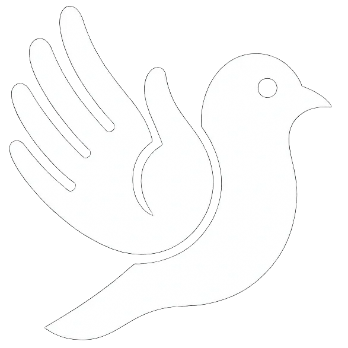
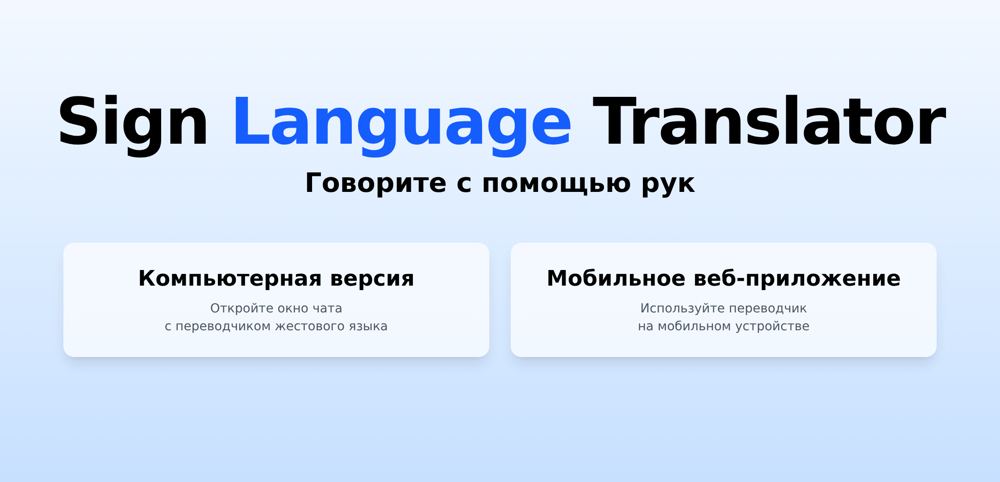
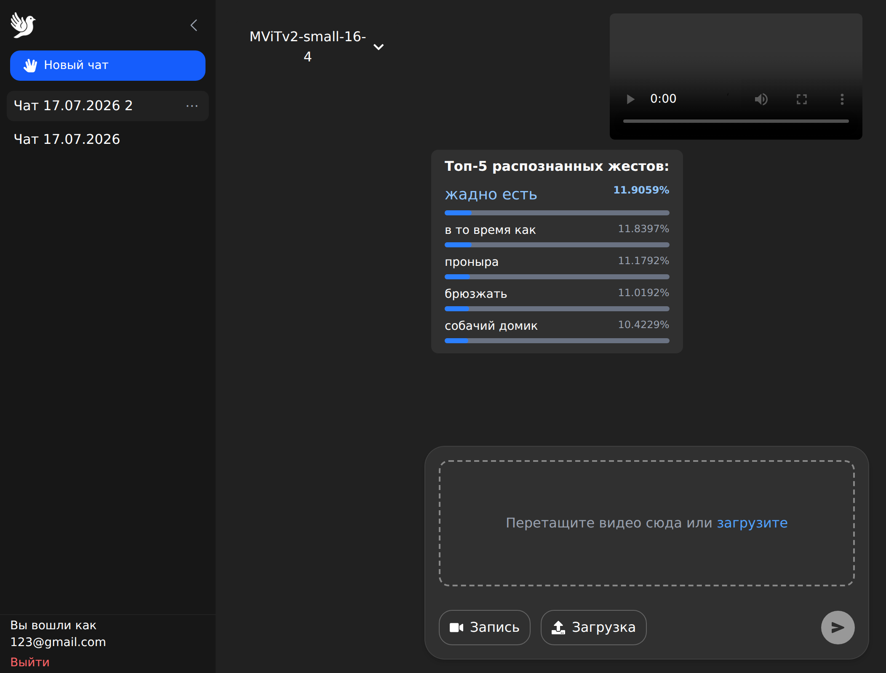
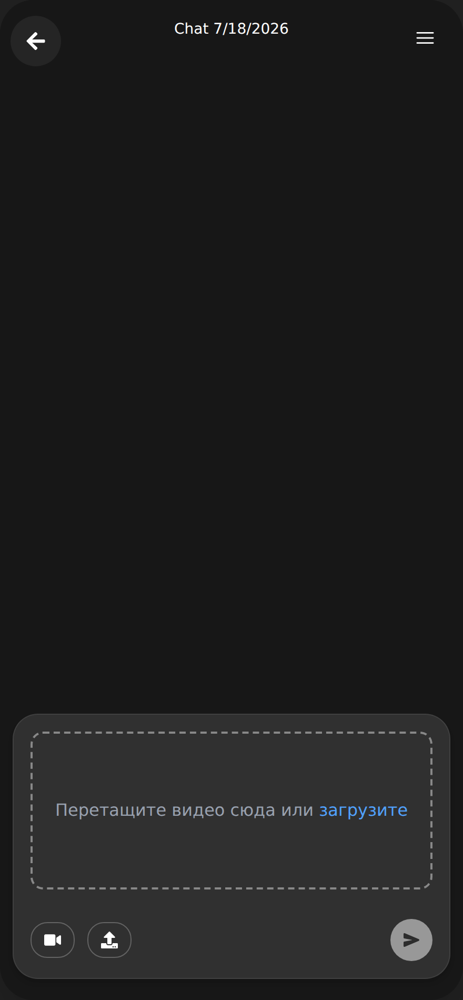
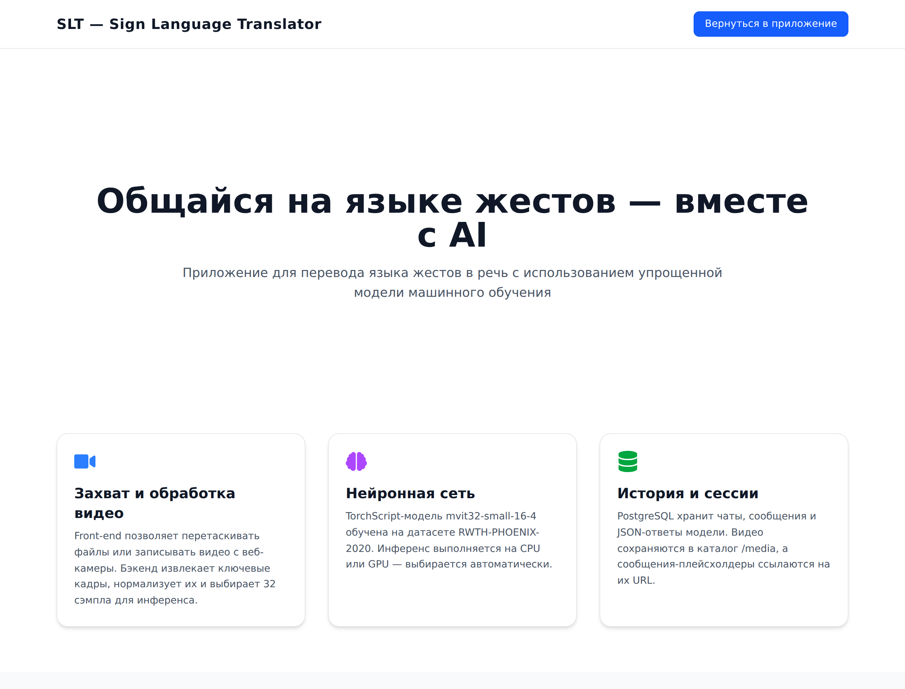

<div align="center">
  

  # SLT — Sign Language Translator

  **A full-stack web application that turns a sign-language video into ranked gesture predictions.**

  [Run locally](#run-with-docker) · [Screenshots](#screenshots) · [Architecture](#architecture)
</div>

## Overview

SLT is a graduation project for exploring video-based sign-language recognition in a practical web interface. A user can sign in, create a chat session, upload a short video or record one with a camera, and receive the model's most likely gesture labels. Sessions, messages, predictions, and uploaded media are kept available for later review.

The application predicts labels from the model's training vocabulary; it is a research and demonstration project, not a replacement for a human interpreter.

## Screenshots

<p align="center">
  
</p>

<p align="center">
  
  <br />
  <em>Desktop workspace: chat history, a submitted video, ranked gesture predictions, and the selected MViTv2 model.</em>
</p>

<p align="center">
  
  <br />
  <em>Phone-friendly workflow with camera and upload controls.</em>
</p>

<p align="center">
  
  <br />
  <em>In-app technology overview.</em>
</p>

## Features

- **Video to gesture predictions** — uploads are decoded with OpenCV, sampled to 32 frames, and passed to a TorchScript MViTv2 model.
- **Camera recording** — record a short WebM video in the browser, then submit it through the same recognition flow.
- **Ranked results** — the API returns the top ten candidate gestures; the chat presents the top predictions clearly.
- **Persistent chat history** — create, rename, and remove personal sessions; messages and prediction payloads are stored in PostgreSQL.
- **Desktop and mobile layouts** — a full desktop workspace and a focused phone-sized chat view share the same API.
- **On-demand audio** — mobile prediction buttons can request cached Russian speech audio for a gesture label.
- **JWT-based sessions** — the client keeps the access token locally and attaches it to authenticated API requests.

## Architecture

```text
React + Vite client
        │  video upload / camera recording
        ▼
FastAPI API ────────────────► PostgreSQL 16
        │                       users · chats · messages
        ├──► OpenCV preprocessing
        │       decode → resize/pad → sample 32 frames
        ├──► TorchScript MViTv2 inference
        │       ranked gesture probabilities
        └──► media volume
                uploaded videos · generated audio
```

### Recognition flow

1. Sign in and open a new chat.
2. Upload a video or record it from the browser.
3. The backend saves the file, extracts frames, normalizes them, and samples 32 frames.
4. The TorchScript model returns the top ten gesture candidates and their probabilities.
5. The video and prediction result are stored in the selected chat session.

## Tech stack

| Area | Technologies |
| --- | --- |
| Frontend | React 19, Vite, Tailwind CSS, React Router, Axios |
| Backend | Python, FastAPI, Uvicorn, asyncpg |
| ML and video | PyTorch / TorchScript, MViTv2, OpenCV, NumPy |
| Data | PostgreSQL 16, JSONB |
| Media | Browser `MediaRecorder`, Silero TTS, pydub |
| Delivery | Docker Compose, Nginx |

## Run with Docker

### Prerequisites

- Docker Desktop with Docker Compose
- The model file `backend/mvit32-2.pt`

The model is intentionally excluded from Git because of its size. Place it next to `backend/gesture_model.py` before starting the backend.

```bash
docker compose up --build -d
```

Open:

| Service | URL |
| --- | --- |
| Web application | http://localhost:5173 |
| Interactive API docs | http://localhost:8002/docs |

Useful commands:

```bash
docker compose ps
docker compose logs -f
docker compose down
```

The Compose setup creates persistent volumes for PostgreSQL data, uploaded media, and the PyTorch cache.

## Configuration

Docker Compose provides development defaults, which can be overridden in a project-root `.env` file.

| Variable | Default | Purpose |
| --- | --- | --- |
| `POSTGRES_USER` | `postgres` | PostgreSQL user |
| `POSTGRES_PASSWORD` | `123` | PostgreSQL password |
| `POSTGRES_DB` | `diploma` | PostgreSQL database |
| `JWT_SECRET` | demo value | Secret for signing access tokens; change it outside local development |
| `FRONTEND_ORIGIN` | `http://localhost:5173` | Allowed frontend origin for CORS |

## Local development

The Docker workflow above is the recommended way to run all three services. To work on the client with the API still running in Docker:

```bash
docker compose up -d db backend
cd frontend
npm ci
VITE_API=http://localhost:8002 npm run dev
```

To run the backend outside Docker, place `mvit32-2.pt` in `backend/`, install `backend/requirements.txt`, and provide a reachable PostgreSQL instance through the `POSTGRES_*` variables. The frontend uses `http://localhost:8000` by default when `VITE_API` is not set.

## API at a glance

| Method | Endpoint | Description |
| --- | --- | --- |
| `POST` | `/register` | Create an account and receive an access token |
| `POST` | `/login` | Sign in and receive an access token |
| `GET` / `POST` | `/sessions` | List or create the signed-in user's chats |
| `PATCH` / `DELETE` | `/sessions/{chat_id}` | Rename or remove a chat |
| `GET` | `/messages?session_id={id}` | Get messages for a chat |
| `POST` | `/predict?session_id={id}` | Upload a video and obtain ranked gesture predictions |
| `GET` | `/audio/{gesture}.mp3` | Get or generate speech audio for a gesture label |

Protected endpoints expect an `Authorization: Bearer <token>` header. Full request and response schemas are available at `/docs` when the backend is running.

## Project structure

```text
AITU_thesis/
├── backend/                 # FastAPI routes, recognition pipeline, and media handling
│   ├── gesture_model.py     # TorchScript inference and /predict endpoint
│   ├── video_utils.py       # frame extraction and preprocessing
│   ├── chat.py              # chat/session persistence
│   └── auth.py              # registration, login, and JWT verification
├── frontend/                # React/Vite client
│   └── src/                 # pages, chat UI, auth, and API client
├── docs/screenshots/        # screenshots used in this README
└── docker-compose.yml       # web, API, and PostgreSQL services
```

## License

This repository is provided for educational and research purposes. Check the licenses and terms of any model weights or datasets before redistribution or production use.
